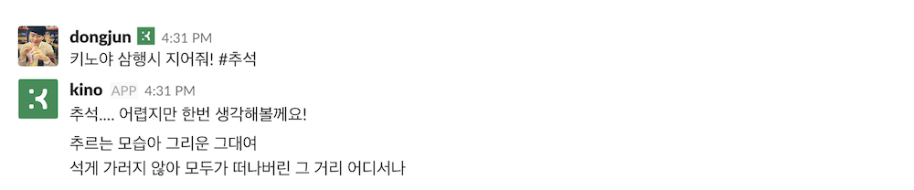
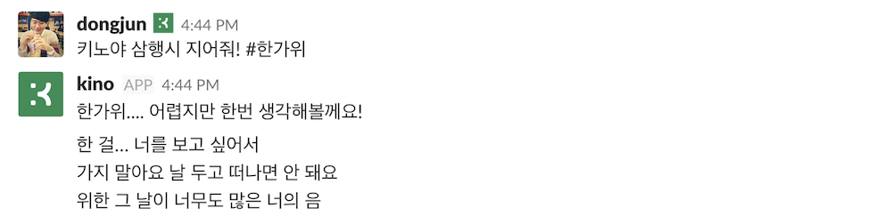

# char-rnn

This code implements multi-layer Recurrent Neural Network (RNN, LSTM, and GRU) for training/sampling from character-level language models.

## Requirements

- Python 3.6
- TensorFlow 1.4
- hb-config

## Features

- Using Higher-APIs in TensorFlow
	- [Estimator](https://www.tensorflow.org/api_docs/python/tf/estimator/Estimator)
	- [Experiment](https://www.tensorflow.org/api_docs/python/tf/contrib/learn/Experiment)
	- [Dataset](https://www.tensorflow.org/api_docs/python/tf/contrib/data/Dataset)
- Korean SamhangSi (like acrostic poem)

## Config

example: check_tiny.yml

```yml
data:
  data_dir: 'data/tiny_lyricskor'
model:
  batch_size: 4
  input_keep_prob: 0.8
  log_dir: 'logs'
  num_layers: 1
  output_keep_prob: 0.8
  rnn_size: 64
  seq_length: 20
train:
  train_steps: 10000
  model_dir: 'tiny_checkpoints'
  save_every: 1
  learning_rate: 0.001
  loss_hook_n_iter: 100
  check_hook_n_iter: 1000
  min_eval_frequency: 100
```

## Usage

First, check if the model is valid. 

```bash
python main.py --config check_tiny --mode train
```

Then, train the model

```bash
python main.py --config kor_ballad --mode train_and_evaluate
```


After training, generate Korean Samhangsi.

```bash
python generator.py --config kor_ballad --word 삼행시
```


### Samhangsi Examples

- 삼행시

```
삼이야 그리움이 좇아 사랑은늘 도망가
행른 잊어버리고 그대 이 세상
시제 너의 곁을 떠나면 빗물에 꽃씨하나 흘러가듯
```

- 기계

```
기를 바라보네 두 손 잡고 고개 끄덕여 달라 하기에
계 울고 싶어 내 맘을 떠나가던 날
```

- 여름

```
여도 지금하럼 커피는 날개니
름다웠던 그대모습 다시 볼 수 없는것 알아요
```

- 커피

```
커나가 그래 돌아서 눈 감으면 잊을까
피고 내가 가고 싶지 아파 만날 날 기다려왔어
```

### Example with kino-bot






## Reference

- [sherjilozair/char-rnn-tensorflow](https://github.com/sherjilozair/char-rnn-tensorflow)
- [insikk/kor-char-rnn-tensorflow](https://github.com/insikk/kor-char-rnn-tensorflow)
- [Higher-Level APIs in TensorFlow](https://medium.com/onfido-tech/higher-level-apis-in-tensorflow-67bfb602e6c0)
